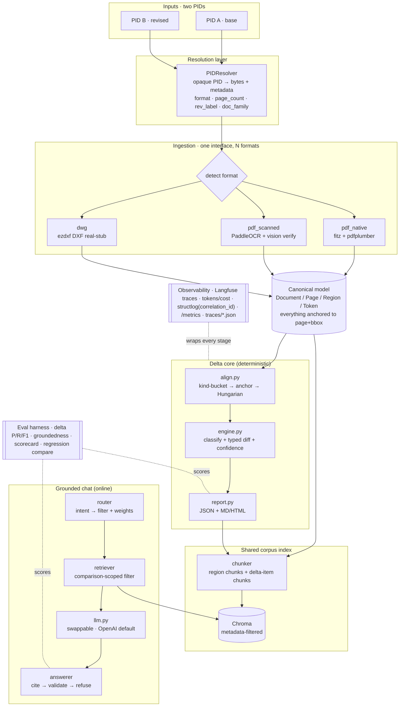
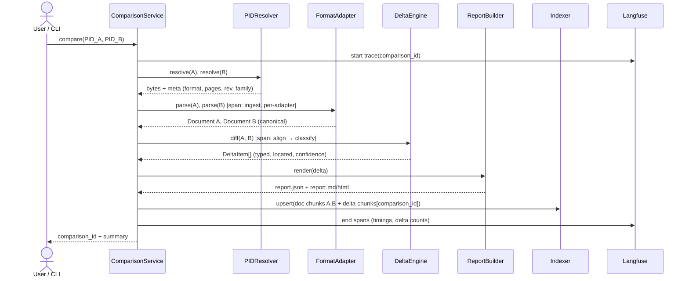
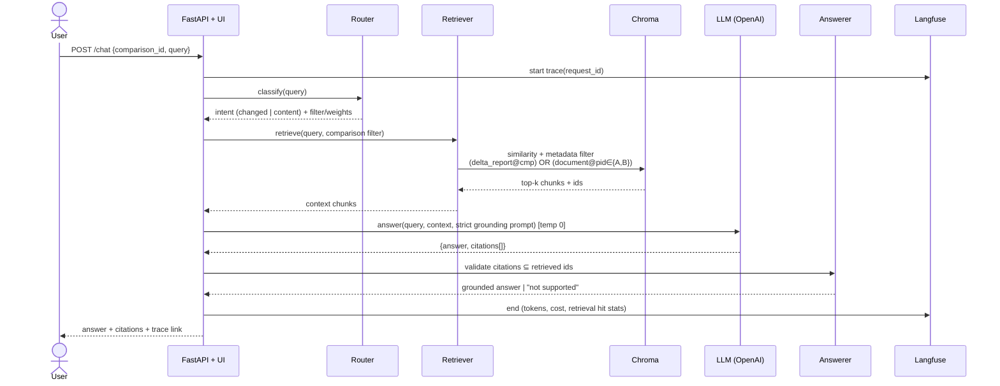

# PLAN — Document Delta & Grounded Chat (Applied AI take-home)

> This is the planning artifact. On approval, build step 0 copies this file into the repo as `PLAN.md` / feeds `README.md`. No implementation code is written yet.

## Context

The assignment asks for the core of a tool that takes **two revisions of a technical document**, computes a structured **delta** (added / removed / modified — each typed, located, confidence-scored), emits a human- + machine-readable **delta report**, and exposes a **chat** grounded in both documents + the delta with citations. Formats in scope: native PDF, scanned PDF, DWG.

Grading weight concentrates in **delta quality (20%)**, **evaluation rigor (20%)**, **observability (15%)**, grounded chat (15%). The plan is deliberately weighted toward those. Flagged failure modes to avoid: a delta that's a thin wrapper over a raw text diff, an ungrounded chatbot, eval that can't detect a regression, and "it works" claims with no trace/metric behind them.

**Locked decisions (from clarifying Q&A):**
- **LLM provider:** OpenAI (GPT) as default, behind one swappable interface, creds from env. AWS Bedrock (Claude) kept as a documented drop-in alternative to honor the org AWS-native preference later.
- **OCR (scanned path):** Hybrid — PaddleOCR for coordinates + confidence, vision-LLM (GPT-4o vision) verify pass on low-confidence regions.
- **Chat surface:** FastAPI REST + a minimal single-page web UI.
- **Observability:** Langfuse (self-hosted via docker-compose).

**Honored clarifications from the brief:** PID = opaque Persistent IDentifier (resolve to bytes + metadata), *not* a P&ID diagram — pipeline stays document-type-agnostic. Unit of work = a **comparison** (ordered pair A→B + delta); chat is scoped **per comparison**. One **shared corpus index**; retrieval filtered to the active comparison. Delta report is a first-class retrievable source. Sister-unit PDFs = realistic demo pair with honest provenance; a **synthetic true-revision pair** is created for controllable eval ground truth.

---

## A. System architecture

Layered, adapter-driven. Maps directly onto the brief's reference architecture (§07 of the assignment: Inputs → Format adapters → Normalize → Core → Grounded chat, with Observability + Eval cross-cutting) and names the two orchestration pieces the reference implies but doesn't draw.



**Two orchestration components (the unit-of-work spine):**
- **`ComparisonService.create(pid_a, pid_b) → comparison_id`** — resolve A+B, ingest→canonical (cached by content hash), run delta, render report, index doc + delta chunks, persist artifacts under `artifacts/<comparison_id>/`. Returns `comparison_id` + summary. This *is* the "comparison = unit of work" from clarification #2.
- **`ChatService(comparison_id)`** — router → retriever(filter) → answerer; stateless per request, scoped to the comparison.

**Module boundaries / contracts (stable interfaces):**

| Component | Contract |
|---|---|
| `PIDResolver` | `resolve(pid) -> ResolvedDoc{bytes, format, page_count, rev_label, doc_family}` |
| `FormatAdapter` | `parse(resolved) -> Document` (one implementation per format; registry picks by `format`) |
| `DeltaEngine` | `diff(doc_a, doc_b) -> Delta{items:[DeltaItem], summary}` — **no LLM in the structural path** |
| `ReportBuilder` | `render(delta) -> {json, md, html}` |
| `Indexer` | `upsert(document \| delta, comparison_id)` → chunks + metadata into shared store |
| `Retriever` | `retrieve(query, comparison_id, intent) -> chunks[]` (applies the comparison filter) |
| `LLMClient` | `complete(...)`, `embed(...)` — provider-agnostic; OpenAI default, Bedrock drop-in |
| `Tracer` | context-manager per stage; correlation id == Langfuse trace id |

**Data stores:** artifact store (canonical JSON + delta JSON/MD per comparison, on disk) · vector index (Chroma, one shared collection) · trace store (Langfuse + `traces/*.json`).

**Divergences from the reference architecture (reasoning, since the brief asks):**
- **Added `PIDResolver`** — the brief stresses PID = opaque handle; the reference folds resolution into "inputs". Making it a real seam lets a PID resolve from disk now, from an object store / DMS later, unchanged.
- **Named `ComparisonService` + `comparison_id`** — the reference implies the pair but doesn't model it; clarification #2 makes the comparison the first-class unit, so it's an explicit orchestrator.
- **One shared index + metadata filter** (not three retrieval sources) — clarification #3; the reference's "PID A · PID B · delta report" become metadata-filtered slices of one collection.
- **Added `Router`** — the reference doesn't show intent routing; needed to split "what changed?" (boost delta chunks) from "what does doc X say?" (filter to one PID).
- Everything else is 1:1 with the reference (adapters → canonical → delta → report → retrieval → LLM → answer + citations; observability + eval cross-cutting).

---

## B. End-to-end workflows

**Workflow 1 — Ingest → Compare (offline / batch, deterministic core):**



**Workflow 2 — Grounded chat (online, per comparison):**



**Workflow 3 — Eval (`make eval`):** load datasets → for each pair run Workflow 1 (`--no-llm` for the deterministic delta baseline) → match predicted vs gold DeltaItems → delta P/R/F1 → run gold Q&A through Workflow 2 → correctness + groundedness + citation + refusal metrics (LLM-judge, temp 0) → print scorecard + write `eval/results/<run>.json`. `make eval-compare` diffs latest vs previous → regression table.

---

## 1. Scope + explicit cuts

**In scope (core, must pass):** native-PDF + scanned-PDF ingestion behind one adapter interface; deterministic structural delta with types/locations/confidence; JSON + Markdown/HTML report; grounded chat (API + minimal UI) with validated citations; one command runs ingest→report→chat. **Required cross-cutting:** Langfuse traces + token/cost, structured logs w/ correlation id, runnable eval scorecard, ≥1 honest failure case, no secrets. **Bonus if time:** delta markup overlay, DWG (DXF) real-stub, retrieval-quality eval, cost/latency budget.

**Deliberate cuts (documented in README):**

| Cut | Reason |
|---|---|
| Binary DWG parsing — DWG handled as a **real stub via DXF (ezdxf)**; DWG→DXF (ODA File Converter) documented, not automated | Binary DWG parsing is disproportionate effort; the adapter seam is proven with DXF entity/dim/geometry extraction. |
| Multi-sheet / 500-sheet scale | Single-sheet handling; sharding + streaming design goes in "what's next". |
| **Topological "moved" detection** (e.g. "valve moved upstream of the pump") — needs a **connectivity graph** | On a P&ID intra-sheet XY position is not engineering-meaningful (drafters reflow sheets). So `moved` = **sheet/page change** only; text XY-moves are ignored; a geometry symbol's intra-sheet shift is emitted as a **low-confidence "layout" signal** (not claimed as a real relocation). True topological move = connectivity extraction, out of scope → "what's next". |
| Managed vector DB / cloud embeddings infra | Local Chroma (or LanceDB) + OpenAI embeddings; keeps run reproducible on a laptop. |
| Auth / multi-user / durable multi-tenant persistence | Local store only; out of take-home scope. |
| Polished frontend | Minimal functional UI (pick base/compare, chat, show citations + trace link). |

---

## 2. Canonical representation (the crux)

Format-agnostic intermediate every adapter normalizes into. Everything anchors to `(page_index, bbox)` so **citations, markup, and delta locations work identically regardless of source format**. Sketch (Python dataclasses / Pydantic):

```python
class BBox:            # origin top-left; store both absolute (points) and normalized 0..1
    x0: float; y0: float; x1: float; y1: float
    x0n: float; y0n: float; x1n: float; y1n: float   # normalized -> cross-DPI / cross-size compare

class Token:           # word-level unit (from PDF spans or OCR)
    text: str; bbox: BBox; confidence: float          # confidence=1.0 for born-digital

class Geometry:        # populated by vector sources (native PDF drawings, DXF); empty for scans
    entity_type: Literal["line","polyline","circle","arc","block_ref","dim"]
    points: list[tuple[float,float]] | None
    layer: str | None; block_name: str | None; dim_value: float | None

class Region:          # a SEMANTIC cluster — the unit of diff AND of chunking
    region_id: str
    kind: Literal["title_block","notes_list","note_item","tag","table","table_cell",
                  "dimension","geometry","callout","legend","text_block","unknown"]
    bbox: BBox
    text: str
    tokens: list[Token]
    confidence: float                                  # extraction confidence (OCR/parse/verify)
    provenance: Literal["native","ocr","ocr+vision","dxf"]
    attrs: dict                                        # kind-specific: {note_number, tag_id, setpoints:{HH,HH,LL...}, value, unit, row, col, field_label}
    geometry: Geometry | None
    neighbors: list[str]                               # spatially-adjacent region_ids (locality for "near the pump")

class Page:
    page_index: int; width: float; height: float; rotation: int
    regions: list[Region]
    raw_text: str                                      # best-effort reading-ordered full text

class Document:        # one PID / one revision
    pid: str; doc_family: str; rev_label: str
    source_format: Literal["native_pdf","scanned_pdf","dwg"]
    page_count: int; metadata: dict; pages: list[Page]
```

**Why this design:**
- **`Region` (typed + `attrs`) is where "smarter than a text diff" lives** — a setpoint, a numbered note, a table cell, an instrument tag are first-class typed units, not lines of text.
- **Token layer preserved under Region** → OCR confidence retained, re-clustering possible, precise sub-region citation.
- **Normalized coords** → compare across slightly different page sizes / DPI (essential for native-vs-scanned of the same sheet).
- **`geometry` optional** → native PDF + DXF populate it, scans leave it empty. The seam holds without special-casing downstream.
- **`doc_family`** groups revisions/sisters for the shared corpus index.
- **`neighbors`** gives the chat locality without a heavier graph.
- **A 4th format** (e.g. image/PNG, or IFC) plugs in by writing one `FormatAdapter` that outputs `Document` — nothing downstream changes. That's the abstraction-survives test the rubric names.

**Adapters** (`ingest/base.py: FormatAdapter.parse(pid) -> Document`):
- `pdf_native.py` — **PyMuPDF (fitz)**: text spans w/ bbox+font via `get_text("dict")`; vector paths via `get_drawings()`; tables via **pdfplumber**. Deterministic, exact coords, no OCR.
- `pdf_scanned.py` — rasterize → PaddleOCR → cluster → vision-verify (see §OCR).
- `dwg.py` — **real stub**: `ezdxf` parses DXF → TEXT/MTEXT (insertion pts → boxes), DIMENSION (value+location), LINE/LWPOLYLINE (geometry), INSERT (block refs) → canonical `Region`s with `geometry`. Binary DWG raises a clear `NotImplementedError` pointing at the documented ODA conversion path. A unit test asserts the interface + DXF extraction, proving the seam is real not hypothetical.

---

## 3. OCR, DPI & bounding-box / region creation (your explicit question)

**Native PDF needs no OCR** — text, vector, and boxes come straight from fitz/pdfplumber (confidence 1.0). OCR is *only* the scanned/raster path.

**OCR engine comparison (why the hybrid):**

| Engine | Boxes+conf | Rotated/vertical drawing text | Determinism | Cost | Verdict |
|---|---|---|---|---|---|
| **PaddleOCR** | word polygons + conf | strong (angle classifier) | deterministic | free/local | **Primary coordinate source** |
| AWS Textract | word/line + conf, great tables | weaker on scattered/rotated drawing labels | deterministic | per-page + network | AWS-native alt; strong for tables |
| docTR | clean boxes | weaker rotation | deterministic | free/local | fallback if Paddle install painful |
| Tesseract | boxes | poor on drawings/rotation | deterministic | free | baseline only, not recommended |
| Vision LLM (GPT-4o) | **no reliable coords**, best semantics | excellent reading | non-deterministic | high | **verify/enrich only, never coord source** |

**Scanned pipeline (produces boxes + regions):**
1. **Render** page → image via fitz at **300–400 DPI** (config). Higher DPI helps dense small tags; trade-off is time/memory — documented + configurable.
2. **Preprocess** (OpenCV): grayscale → deskew (minAreaRect/Hough) → adaptive threshold. Improves scanned OCR materially.
3. **PaddleOCR** `use_angle_cls=True`, det+rec → `(polygon, text, confidence)` per word. Polygon → axis-aligned `BBox`.
4. **Coord transform** image-px → canonical page coords (scale by DPI ratio; consistent top-left origin) → fills normalized coords too.
5. **Region clustering (semantic, not linear):**
   - **Notes list:** detect leading `^\d+\.` → split into `note_item` regions with `attrs.note_number` (enables note-number-anchored matching in §4).
   - **Instrument tags:** regex family (e.g. `\d{2}-[A-Z]{2,4}-\d{3,4}`, `PIT\s?9055`, `26-KA-901`) → `kind=tag`, `attrs.tag_id` normalized.
   - **Setpoints/dimensions:** `HH\s*:\s*\d+`, `LL\s*:\s*\d+`, `SP\s*=\s*\d+\s*bar` → `attrs.setpoints` / `attrs.value+unit`.
   - **Title block:** bottom-right rectangle heuristic → field/value pairs (`SERVICE`, `DUTY`, `FLOW RATE`…) as `attrs.field_label`.
   - **Tables:** aligned-grid detection → `table` / `table_cell` with row/col.
   - **General text blocks:** DBSCAN / connected-components on box centroids to group nearby words into blocks; `neighbors` computed by proximity.
6. **Vision-LLM verify (isolated non-determinism):** for regions with OCR conf < threshold OR tag-like text failing the tag regex, crop the region image and ask GPT-4o vision to transcribe exactly. Replace `text`, set `provenance="ocr+vision"`, **keep the OCR box**. Directly mitigates drawing-text scrambling. Every verify call is logged (prompt/response/tokens/cost) and thresholded + content-hash cached to bound cost.

Result: precise boxes for every unit (native and scanned), typed semantic regions, and a confidence signal that flows into both the delta and the eval.

---

## 4. Alignment + delta strategy (delta quality — 20%)

Matching is the hard part; keep it **mostly deterministic** (reproducibility requirement) and put the LLM only where semantic judgment genuinely helps.

**Alignment tiers (A=base, B=revised):**
1. **Sheet align** — by sheet number / title-block id (single-sheet here, but coded for N).
2. **Kind-bucketed** — match only within the same `kind` (notes↔notes, tags↔tags, cells↔cells, fields↔fields). Kills cross-type false matches.
3. **Identifier-anchored (highest precision):**
   - Notes by `note_number`; tags by normalized `tag_id`; title-block by `field_label`; table cells by `(row_header, col_header)`.
4. **Fuzzy fallback (unanchored blocks):** within a kind, build a cost matrix `cost = w1·(1−text_sim) + w2·(1−spatial_sim)` where text_sim = token-set ratio / embedding cosine, spatial_sim = bbox IoU / centroid distance (on normalized coords). **Hungarian assignment** + threshold → matched / unmatched.
5. **Classify:** unmatched-in-A → `removed`; unmatched-in-B → `added`; matched-with-diff → `modified`.

**Typed modify diff (this is what beats a raw text diff):**
- text → normalized string diff (whitespace/case config).
- **setpoint/dimension → parse `value+unit`, report numeric old→new→delta** (e.g. `HH: 245 → 214`, Δ−31 barg) as a typed change, not a string change.
- geometry (DXF) → entity added / removed / moved.
- **confidence** = documented deterministic blend of extraction conf (OCR) × match score (similarity) × classification certainty.

**Where the LLM sits — and where it does NOT (rubric asks this explicitly):**
- **NOT in structural alignment/diff.** The set of matched/unmatched items and their types is fully deterministic + reproducible. A `--no-llm` mode produces the complete structural delta with zero LLM calls → the regression baseline.
- **LLM used in exactly three narrow, isolated jobs:**
  1. Scanned OCR **verify** (vision) — transcription cleanup only (§3).
  2. **Ambiguous-modify annotation** — for the fuzzy-matched, low-confidence subset only: "is this a meaningful change vs OCR noise / reword?" → returns a significance flag + a human-readable description. It **annotates** items; it does **not** decide the matching. So structural determinism is preserved.
  3. **Report prose** — grouping narrative / summary (cosmetic, temp 0, cached).
- **Justification:** matching is combinatorial/geometric — deterministic methods are more reliable, debuggable, reproducible. The LLM adds value only in fuzzy semantic judgment + natural-language description, exactly where non-determinism is acceptable and can be quarantined. Temp 0 everywhere; all prompts/outputs logged.

---

## 5. Delta report (core)

- **JSON (machine):** `{summary:{counts by type+kind}, items:[DeltaItem{id, change_type, kind, location{page,bbox,region_id}, a_ref, b_ref, description, value_change?, confidence, evidence}]}`.
- **Markdown/HTML (human):** counts table; grouped by kind × change_type; per-item location + confidence + citation anchor; HTML links to markup overlay (bonus).
- The report is **chunked into the shared index** (`source_type=delta_report`, `comparison_id`) → first-class retrievable source for chat.

---

## 6. RAG / chat (grounded chat — 15%)

**One shared corpus index** (Chroma/LanceDB, local; OpenAI `text-embedding-3-small` behind a swappable embedder). **Comparison-scoped retrieval** at query time — never open-ended over the whole store.

**Chunking — semantic regions, not blind token slices:**
- Document chunks = **one per `Region`** (note_item, tag+its setpoints, table row, title-block field group, text_block). Tag chunks carry `neighbors` text so "near the pump" style locality works.
- Delta chunks = **one per `DeltaItem`** (text = description + old/new + location).

**Chunk metadata schema:** `{pid, doc_family, rev, source_type: document|delta_report, comparison_id, page, region_id, bbox, kind, tag_id?}`.

**Retrieval filter (keeps citations in-bounds):** active comparison `(A, B, comparison_id)` is known before chat starts, so:
```
filter = (source_type == "delta_report" AND comparison_id == active)
      OR (source_type == "document"      AND pid IN {A, B})
```
then vector similarity within the filtered set.

**Query routing ("what changed?" vs "what does doc X say?"):**
- Lightweight intent router (deterministic rules first, LLM fallback for ambiguous phrasing) sets **filters + weights, not the answer**:
  - change-intent (changed/added/removed/difference/delta/revised/vs) → boost `delta_report` chunks + pull supporting document chunks from both A and B.
  - content-intent → detect an A/B reference (base/revised, old/new, rev label); if named, filter `pid` to that one; if not, search both and let citations disambiguate.
- **Answer synthesis:** strict grounding prompt — answer only from context; cite every claim as `[pid/page/region]` or `[delta:item_id]`; if unsupported, say so. Returns `{answer, citations[]}`. **Citations validated against retrieved chunk ids** — hallucinated cites dropped → citation accuracy is measurable, and refusal path exists.

---

## 7. Observability (Langfuse self-hosted — 15%)

- **Langfuse** via docker-compose (Postgres). One **trace per request** (`ingest` / `compare` / `chat`) with nested spans: `ingest→adapter`, `delta→align→classify`, `retrieve`, `llm_call(s)`, `answer`.
- **LLM telemetry:** Langfuse OpenAI wrapper auto-captures prompt, response, model, token counts, cost (model prices configured).
- **Structured logs:** `structlog` JSON with `correlation_id == Langfuse trace_id` → logs and traces join. Also dump **one trace file per run** to `traces/` for offline inspection without the UI (satisfies the brief's minimum literally).
- **Metrics:** per-stage latency, tokens/cost per request, delta counts, retrieval hit stats (chunks returned, sources, filter size) → Langfuse dashboard + a FastAPI `/metrics` summary endpoint + surfaced in the eval scorecard.
- **Failure visibility:** OCR-low-confidence, unparseable DWG, LLM timeout/error → span `status=error` with detail, logged, visible — never swallowed. LLM retry/backoff with logged attempts.
- **Why Langfuse:** LLM-native cost/token tracking **and** dataset/eval-run linkage — the *same* tool powers observability and eval regression tracking; self-hosted keeps document data local (no leakage). Trade-off (extra docker service) documented.

---

## 8. Eval harness (evaluation rigor — 20%)

**Dataset (`eval/datasets/`):**
- **Pair 1 — synthetic revision (controllable GT, primary regression case):** take the Export PDF, apply a **documented edit list** (e.g. setpoint HH:150→175, delete a note, add a note, rename a tag, change a duty value), re-export → A vs A′. The edit list *is* the gold delta (deterministic).
- **Pair 2 — sister units (real-world):** Lift vs Export, hand-labeled salient deltas (renumbered tags, setpoint diffs, balance-line-cooler subsystem present on Lift only, duty/flow diffs). Realistic, noisier; label conservatively.
- **Pair 3 — scanned robustness:** rasterize + degrade (noise/skew) one PDF → scanned twin of its native self. Ideal delta ≈ **empty**; anything detected = OCR-induced false positives → **quantifies OCR noise** (strong honesty signal).
- **Q&A set (~15–25):** questions across pairs with gold answers + **gold citation targets**; include unanswerable questions to test refusal.

**Delta metrics:** match predicted↔gold DeltaItems by (kind, location overlap, change_type, normalized value) → **Precision / Recall / F1**, broken down per change_type + per kind. Plus **value-accuracy** for modified items (old→new correct?) and **localization IoU** (bonus).

**Chat metrics:** correctness (LLM-as-judge, graded, + exact/semantic where possible); **groundedness / citation accuracy** — (a) cited chunks ∈ retrieved set (automatic), (b) citations support the claim (judge/overlap), (c) citation precision/recall vs gold targets; **refusal correctness** on unsupported questions.

**Validate the judge (so the judge is trusted):** hand-label ~10 answers with human scores, measure judge agreement (accuracy / Cohen's κ) vs human, report it. Judge runs temp 0, structured rubric, and (where possible) a different model than the one under test.

**Scorecard + regression comparability:** `make eval` runs all cases → prints a scorecard table (delta P/R/F1 per pair, chat correctness, groundedness, refusal, latency, cost) and writes `eval/results/<run>.json`. Comparability via fixed dataset + fixed seeds + `--no-llm` deterministic delta baseline + versioned result JSON. `make eval-compare` diffs latest vs previous → **regression table** (metric deltas, flags drops). A **candid failure table** ships in the README, auto-seeded from sub-threshold cases.

---

## 9. Repo scaffold + Makefile

```
delta-chat/
├─ README.md              # run, decisions, trade-offs, cuts, obs+eval, what's-next, failure table
├─ PLAN.md                # this document
├─ DEMO.md                # 2–4 min walkthrough (or recording link)
├─ .env.example           # OPENAI_API_KEY, LANGFUSE_*, model + threshold config (NO real keys)
├─ Makefile
├─ docker-compose.yml     # langfuse (+postgres) + app
├─ pyproject.toml
├─ config/                # models, thresholds, DPI, paths — config over hardcoding
├─ src/
│  ├─ ingest/  base.py  pdf_native.py  pdf_scanned.py  dwg.py
│  ├─ canonical/ model.py
│  ├─ delta/   align.py  engine.py  report.py
│  ├─ chat/    index.py  retrieve.py  router.py  llm.py  answer.py
│  ├─ markup/  overlay.py            # bonus
│  ├─ observability/ tracing.py  logging.py  metrics.py
│  └─ app/     api.py  ui/           # FastAPI + minimal single-page UI
├─ eval/  datasets/  metrics.py  judge.py  run_eval.py  compare.py  results/
├─ data/samples/         # 3 pairs + PROVENANCE.md (sister-unit + synthetic + scanned honesty)
├─ traces/               # one JSON trace file per run
└─ tests/
```

**Makefile targets:** `setup` · `up` (docker-compose: langfuse+app) · `run` (ingest+delta+report on a sample pair) · `chat` (launch API+UI) · `markup` (bonus overlay) · `eval` (scorecard) · `eval-compare` (regression diff) · `test` · `fmt` / `lint`.

---

## 10. Milestones (Saturday time-box) + Minimum Viable Submission

Sequenced so **MVS is reached early**, then enhancements layer on. Majority-weight items (delta, eval, observability) protected ahead of bonuses.

- **M0 — setup (~1h):** scaffold, config loader, OpenAI provider interface, Langfuse + docker, structlog.
- **M1 — MVS core (~3–4h):** native-PDF adapter (fitz)→canonical; deterministic delta (note/tag/title-block anchored + fuzzy fallback + typed setpoint diff) on the synthetic pair; JSON+MD report; shared index + comparison filter + grounded chat over API+UI with validated citations; one end-to-end trace. ➜ **✅ MVS checkpoint: 1 format, real structured delta, grounded cited chat, one command — submittable.**
- **M2 — second format (~2–3h):** scanned adapter (render→preprocess→PaddleOCR→cluster→vision-verify) → 2 of 3 formats; sister + scanned pairs flowing.
- **M3 — eval harness (~2–3h):** 3 datasets, delta P/R/F1, chat correctness+groundedness, judge validation, scorecard + compare. *(Protect this — 20% weight.)*
- **M4 — observability polish (~1h):** full spans, cost, `/metrics`, failure cases, trace files.
- **M5 — bonuses if time:** markup overlay (draw DeltaItem bboxes → annotated PDF); DWG DXF real-stub; retrieval-quality eval; cost/latency budget.
- **M6 — docs/demo (~1.5h):** README, DEMO.md/recording, sample provenance.

---

## 11. Risks + mitigations

| Risk | Mitigation |
|---|---|
| OCR quality on dense P&IDs (scrambled/rotated tags) | PaddleOCR angle-cls + 300–400 DPI + deskew + vision-LLM verify on low-conf; scanned-noise eval case quantifies residual error and reports it. |
| Drawing-text reading-order scramble breaks chunks | Region clustering by spatial proximity + tag/note regex anchoring (not linear text); one chunk per semantic region. |
| Alignment false matches (sisters differ a lot) | Kind-bucketed + identifier-anchored first; fuzzy Hungarian only within kind + threshold; confidence exposes weak matches; conservative GT labels. |
| LLM non-determinism polluting "reproducible delta" | Structural delta fully deterministic (`--no-llm` baseline); LLM only annotates/describes; temp 0; documented. |
| Cost/latency (vision verify + judge) | Thresholded vision calls, content-hash cache, cheap model for chat, stronger model only for judge; budget table in eval. |
| Citation hallucination | Validate cited ids against retrieved set, drop invalid, measure citation accuracy; strict grounding prompt + refusal path. |
| DWG parsing blocking progress | DXF real-stub only; never on the MVS critical path. |
| Sister pair ≠ true revisions | Honest `PROVENANCE.md` + synthetic true-revision pair for controllable eval GT. |
| PaddleOCR / dependency install friction | PaddleOCR primary (local); docker contains deps; docTR documented fallback. |
| Secrets leakage | `.env.example` only, env-var creds, `.gitignore` keys, pre-commit check; document data stays local (self-hosted Langfuse). |

---

## 12. Verification (how we prove it end-to-end)

1. `make up` → Langfuse + app healthy.
2. `make run` on the synthetic pair → JSON + MD delta report produced; open Langfuse → one trace, per-stage timings, token/cost visible; `traces/<run>.json` written.
3. `make chat` → in the UI pick base/compare, ask a "what changed?" query and a "what does the revised doc say about X?" query → answers carry citations that resolve to real regions/delta items; ask an unsupported question → it refuses.
4. `make eval` → scorecard prints delta P/R/F1 (incl. the synthetic pair where GT is exact), chat correctness + groundedness, judge-agreement number, ≥1 failure case; `eval/results/<run>.json` written.
5. `make eval-compare` after a deliberate regression (e.g. loosen a threshold) → regression table flags the metric drop — proves the eval catches regressions.
6. Bonus: `make markup` → annotated PDF with delta bboxes overlaid.

---

## Open assumptions (flagged for your review)
- OpenAI is the graded default despite the org AWS-native preference — honored per your explicit choice; Bedrock stays a documented drop-in. Say the word to flip the default.
- Effort budget assumed ~1 focused day. If tighter, MVS (M1) + eval (M3) is the non-negotiable core; M2 scanned is the next priority.
- Synthetic revision edits will be authored by us and fully documented; if you have a real revision pair, it replaces Pair 1 as primary GT.
