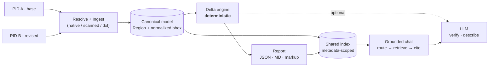

<div align="center">

# Document Delta & Grounded Chat

**Diff two revisions of a technical document into a *typed, located, confidence-scored* delta — then chat over it with citations that resolve to the exact region on the page.**


</div>

Two of three formats are built: **native PDF** and **scanned PDF** (real OCR path). The
**DWG/DXF** adapter is a registered-but-unimplemented seam (honest cut — see below). Unit of
work is a **comparison** — an ordered pair (base → revised); chat is scoped per comparison over
one shared index.

> **Note** — "PID" in this codebase means **Persistent IDentifier** (an opaque handle resolved
> to bytes + metadata), *not* the P&ID diagram. The pipeline is document-type-agnostic; P&IDs
> are just the demo domain.

---

## Contents

[Architecture](#architecture) · [Run](#run) · [Design decisions](#key-design-decisions--trade-offs) · [What I cut](#what-i-deliberately-cut) · [Observability](#observability) · [Evaluation](#evaluation) · [What's next](#what-id-do-next-with-more-time)

---

## Architecture



**Seam:** every format adapter normalizes into one canonical model —
`Document → Page → Region → Token`, everything anchored to `(page, normalized bbox 0..1)`.
The delta, the citations, and the markup all operate on that model, so they behave identically
whether the source was born-digital or OCR'd.

---

## Run

**Setup** — Python 3.10+:

```bash
make setup                 # venv + deps
cp .env.example .env       # then paste your OPENAI_API_KEY
source .venv/bin/activate
```

> The deterministic delta + delta-eval run **with no API key**. Chat, the LLM router,
> vision-verify, and Ragas need `OPENAI_API_KEY`.

| Command | What it does |
|---|---|
| `make run A=<pdf> B=<pdf>` | ingest → delta → report → index. Writes `artifacts/<id>/{report.json, report.md, meta.json}` |
| `make chat` | FastAPI + web UI at **http://localhost:8001** (8000 is nginx here) |
| `make markup CMP=<id>` | bonus: overlay delta bboxes → annotated `markup.pdf` |
| `make eval` | scorecard — delta P/R/F1 + chat citation/retrieval/refusal + Ragas → `results/run-<timestamp>.json` |
| `make eval-baseline` | freeze the current run as `results/baseline.json` (regression reference) |
| `make eval-compare` | diff **baseline vs newest run**; **exits 1 on any F1 drop** |
| `make up` | *optional* — self-hosted Langfuse mirror of the file traces |

**Try it end to end:**

```bash
make run A=data/samples/lift-gas-compressor.pdf B=data/samples/export-gas-compressor.pdf
make chat        # open localhost:8001, pick the comparison, ask "did the compressor duty change?"
```

Ask a question → cited answer → click the `[1]` badge → the source page renders with the region
highlighted. A 2–4 min walkthrough is in **[DEMO.md](DEMO.md)**.

---

## Key design decisions & trade-offs

<table>
<tr><td><b>One canonical model behind every format</b></td></tr>
</table>

`Region` is **typed** (`note_item`, `tag`, `title_block`, `dimension`, `callout`,
`table_cell`, …) with a kind-specific `attrs` bag (note number, tag id, parsed setpoints,
field label). This is where *"smarter than a text diff"* lives — a setpoint or an instrument
tag is a first-class unit, not a line of text. A new format plugs in by writing one adapter
that outputs `Document`; nothing downstream changes.
*Trade-off:* the normalization layer is upfront work — but it's what makes citations, markup,
and delta locations behave identically across native and scanned.

<table>
<tr><td><b>The delta is deterministic; the LLM is quarantined</b></td></tr>
</table>

Alignment is **kind-bucketed → identifier-anchored** (note#, tag, field, instrument) **→ fuzzy
fallback** (Hungarian assignment on a content-dominant `0.8·text + 0.2·spatial` cost).
Classification and typed diffs (numeric `776 → 1835 Δ=1059`, setpoint `HH 245 → 214`) are pure
code — `--no-llm` produces the **complete** structural delta with zero LLM calls, which *is* the
regression baseline. The LLM does exactly three isolated jobs: OCR **vision-verify**,
**significance annotation + crisp descriptions** of already-matched text items, and report
prose — it **never decides structure**.
*Trade-off:* deterministic matching can't reason about deep semantic equivalence, but it's
debuggable, cheap, and reproducible — the right default for a diff.

<table>
<tr><td><b>Hybrid OCR</b> · <b>one shared scoped index</b> · <b>grounded answering</b></td></tr>
</table>

- **OCR** — PaddleOCR gives boxes + per-word confidence (coordinate source of truth); a GPT-4o
  vision pass re-transcribes **only** low-confidence crops and **keeps the OCR box**. Vision
  LLMs read drawing text well but give no reliable coordinates — so they verify, never localize.
- **Retrieval** — one Chroma collection, always filtered to the active comparison and the right
  slice (delta entries for *"what changed"*, document regions for *"what does X say"*). Chunking
  is **semantic per region**, so a citation maps back to a real bbox. An **LLM self-query
  router** maps the question to intent + keys by *meaning*, not filename, with a rule fallback.
- **Answering** — model cites `[n]`; citations are **validated against the retrieved set**
  (hallucinated / out-of-range refs dropped); unsupported questions get a hard **refusal**.
- **Provider** — OpenAI default behind one swappable interface, creds from env; **Bedrock**
  (Claude) is a documented one-line swap.

---

## What I deliberately cut

| Cut | Why |
|---|---|
| **DWG / DXF** ingestion (the 3rd format) | Assignment scopes **2 of 3** formats; native PDF + scanned PDF are built. The `dwg` adapter is **registered but not implemented** — it proves the registry extends and `parse()` raises a clear error pointing at the ezdxf DXF path + ODA-converter step for binary DWG. Honest stub, not a hidden gap. |
| Multi-sheet / 500-sheet **scale** | Single-sheet handling; sharding + streaming is in *what's next*, not built. |
| Pixel-level **geometry move-detection** on rasters | Unreliable on scans. Moves limited to sheet/location shifts on typed regions. |
| **Connectivity / topology** diff (line-net changes) | Needs graph extraction the layer doesn't reliably give yet — flagged as research. |
| Managed vector DB / cloud infra | Local Chroma keeps the run reproducible on a laptop. |

> **Honest known limitation** — on the *sister-unit* pair (Lift 26-KA-901 vs Export 26-KA-902,
> realistic but **not literal revisions**), setpoint pairing degrades because everything is
> renumbered at once. Instrument-anchoring works on true revisions; the sisters expose its edge.
> The synthetic-revision eval pair covers the true-revision case with exact ground truth.

---

## Observability

- **One JSON trace per request** in `traces/`, named
  `<date>_<time>__<kind>__<comparison_id>__<shortid>.json` — sorts chronologically, shows which
  comparison at a glance. Each trace: nested timed spans (`ingest → delta → report`, or
  `route → retrieve → answer`), the retrieved chunks, **tokens + cost per LLM call**, plus
  top-level `timestamp` + `comparison_id`.
- `correlation_id == trace_id` → structured JSON logs join to traces.
- **`GET /metrics`** serves a live summary (latency, tokens, cost, delta counts).
- **Langfuse** (self-hosted, `make up`) is an *optional mirror* of the same tree — the file
  traces satisfy the requirement with zero infra. Errors surface as `status=error` spans;
  vision-verify and judge costs are recorded, never swallowed.

---

## Evaluation

Deterministic metrics **and** an LLM-judged pass with a **separate judge model** (`gpt-4o` ≠ the
`gpt-4o-mini` answer model), so the judge isn't grading itself.

| Area | Metric | Result |
|---|---|---:|
| Delta — synthetic revision | F1 (exact ground truth) | **1.00** |
| Delta — sister units | F1 (real pair, title-block scope) | **0.93** |
| Delta — scanned noise | false positives (ideal = 0) | *reported* |
| Chat | citation precision / recall | **0.76–0.80 / 1.00** |
| Chat | retrieval recall@k | **1.00** |
| Chat | refusal accuracy (0 hallucination, 0 false-refusal) | **1.00** |
| Chat — Ragas | faithfulness / context recall | **high** |
| Chat — Ragas | factual correctness | *deflated — see note* |

- **Scanned-noise** pair is an OCR-twin whose ideal delta is empty, so any detection
  **quantifies OCR noise** honestly.
- **Factual-correctness** is deflated by terse gold vs. verbose answers — flagged, not trusted
  blindly.
- **Regression** — `make eval-baseline` freezes a reference run; `make eval-compare` diffs
  **baseline vs the newest run** and flags any F1 drop, so a threshold change that regresses
  quality is caught, not shipped.

---

## What I'd do next (with more time)

<table>
<tr><td width="33%"><b>⏱ OCR latency</b></td>
<td>(1) batch page renders + <b>GPU detection</b> — the CPU path here forces
<code>enable_mkldnn=False</code> to dodge an oneDNN crash, which a GPU build removes;
(2) <b>tile large pages</b> and OCR tiles in parallel; (3) <b>cache OCR by page
content-hash</b> so re-ingest is free; (4) <b>skip vision-verify above a confidence floor</b>
and batch remaining crops into one multi-image call instead of N. Target: sub-second/page on
GPU, verify bounded to a handful of crops.</td></tr>

<tr><td><b>🔍 RAG quality + scale</b></td>
<td>Move to <b>true hybrid search</b>: <b>BM25 / lexical</b> (exact tags, note numbers, part
codes are lexical — where dense embeddings miss) <b>fused with dense vectors via Reciprocal
Rank Fusion</b>, then a <b>cross-encoder re-ranker</b> (e.g. <code>bge-reranker</code>) over the
fused top-N. Add query expansion for domain synonyms and parent/section retrieval for long
tables. At scale, a <b>sharded index partitioned by <code>doc_family</code></b> so a comparison
only searches its own slice.</td></tr>

<tr><td><b>📐 Delta depth</b></td>
<td>Biggest quality lever is understanding these drawings better. Study <b>P&ID / ISA-5.1
symbology</b> across more real sheets to (1) parse <b>connectivity / topology</b> (which loops
and line segments changed, not just text), (2) add <b>symbol / equipment recognition</b> so a
valve or vessel is a typed region with its own diff rules, (3) widen the <b>setpoint / dimension
grammar</b> and title-block ontology so numeric changes are caught across every notation
variant.</td></tr>
</table>

**Also:** binary DWG via automated ODA conversion · multi-sheet sharding + streaming ingest ·
judge-agreement validation (human-labeled subset + Cohen's κ) to put a trust number on the LLM
judge.
